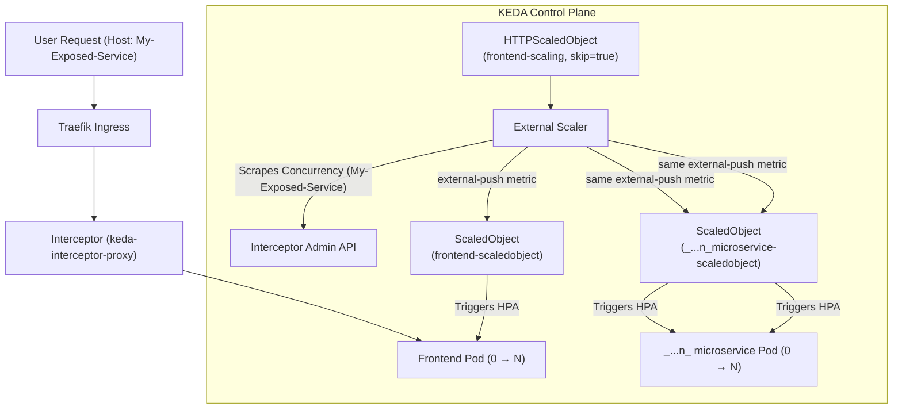

-

## KEDA Feels Like Magic—Until You Realize It’s Just Events

If you’ve ever tried to autoscale Kubernetes workloads beyond CPU and memory, you’ve probably run into the same frustration I did. What if I don’t care about CPU at all?

What if my app should scale based on:

- messages in a queue
- HTTP traffic
- a custom metric, queue, alert
- or even a business event

That’s exactly why I started experimenting with [KEDA](https://keda.sh). This post is based on a small PoC I built [here](https://github.com/greenorchid/k3d-playground/tree/keda-testing-symmetric-activation). And while going through this, something clicked for me: _Scaling doesn’t have to be an infrastructure concern—it can be a developer concern._

## The mental model shift: from resources → events

Traditional Kubernetes autoscaling (HPA) answers _"How busy is my container?”_. KEDA answers something much closer to what I actually care about: _“Is there work to do?”_

That shift is subtle, but it changes everything. With KEDA:

- A **scaler** connects to an external system (Kafka, HTTP, Prometheus, etc.)
- It checks if there is work (events)
- It activates your workload (even from zero)
- Then hands off scaling to HPA for 1 → N replicas

This split—**activation vs scaling**—is where things start to feel powerful.

## Activation is the real superpower

One of the most interesting things I explored in my PoC is **activation thresholds**. You’re not just defining _how much to scale_, you’re defining: _“When should this thing even exist?”_.
KEDA splits scaling into two phases:

- **Activation (0 → 1)**
- **Scaling (1 → N)**

Example:

```yaml
triggers:
  - type: kafka
    metadata:
      threshold: '10'
      activationThreshold: '1'
```

This means:

- Don’t even start the workload unless there’s at least 1 message
- But once running, scale more aggressively at 10+

That gives a level of control I don’t get with traditional autoscaling.

## My PoC: symmetric activation across services

In my repo, I experimented with something I’d call:

> **Symmetric activation across multiple services**
> https://github.com/greenorchid/k3d-playground/tree/keda-testing-symmetric-activation

The idea was simple:

- Multiple services
- Reacting to the same signal
- Waking up together

At first, I thought I could just share a scaler across workloads.

But that’s not how KEDA works—and that’s actually a good thing.

Each `ScaledObject` targets exactly one workload.

So instead of sharing the scaler, I ended up sharing:

- the **event source**
- or the **metric**

That’s the real abstraction in KEDA.

## HTTP scaling: making request-driven systems work

I also explored the [HTTP add-on](https://github.com/kedacore/http-add-on)

This is where things start to feel a bit like serverless:

- Requests come in
- A proxy buffers/counts them
- Your service scales from zero

From a developer perspective, the key realization for me was:

> HTTP is just another event source.

Once I started thinking of it that way, everything became composable.

### Developer experience: local environments & scaling from zero

This is where things got really interesting for me. In a previous life, I worked on building a PaaS for developers. One of the constant challenges was cost—especially for lower environments. The obvious solution was to shut things down when they weren’t in use. What we ended up with was fairly typical:

- Default schedules (e.g. weekdays, 9am–6pm)
- Everything off outside those hours
- Everything back on the next morning

But reality isn’t that neat.

Once you factor in:

- global teams
- developers sharing work across timezones
- “elastic” timezones (people travelling with their environments)
- different weekend patterns globally

...it quickly breaks down. And even worse, everything would start and stop at the same time. Entire stacks coming online together, regardless of whether anyone actually needed them.

### Activate native k8s resources

KEDA’s **activation phase** introduces a completely different model. Instead of time-based scheduling, environments can be: **event-driven and symmetrical**. A single event can activate an entire stack—exactly when it’s needed.

And with a configurable `scaledownPeriod`, those resources can remain available for as long as the developer wants before scaling back to zero.

That gives a much more natural workflow:

- open your app → environment wakes up
- keep working → it stays alive
- walk away → it eventually scales back down

No schedules. No guessing. No coordination.

### Separating Activation from Scaling for multiple microservices

KEDA does not separate activation and scaling per trigger.
Consider the architecture below



Each trigger:

- contributes to activation (0 → 1)
- contributes to scaling (1 → N)

So if you attach the HTTP trigger to multiple custom ScaledObjects (e.g. microservices) it will scale based on HTTP traffic — not just activate. HIn other words, KEDA (currently) doesn't suport "Activation-only triggers". However there is a workaround. One can tune the activation trigger to effectively use asentinel value to neutralize scaling influence (essentially mking it a no-op) and allow another trigger, say cpu or memory, or another event ;-) handle the scaling of this object/microservice. E.g.

```yaml
apiVersion: keda.sh/v1alpha1
kind: ScaledObject
metadata:
  name: middleware-scaledobject
spec:
  scaleTargetRef:
    name: middleware
  minReplicaCount: 0
  maxReplicaCount: 100
  triggers:
    # Trigger 1: HTTP → ONLY for activation
    - type: external-push
      metadata:
        httpScaledObject: frontend-scaling #This is the HTTPScaledObject
        scalerAddress: keda-add-ons-http-external-scaler.keda:9090
        activationTargetValue: '1' # wake up quickly
        targetValue: '1000000' # effectively disables scaling influence
    # Trigger 2: real scaling signal (example CPU via HPA fallback)
    - type: cpu
      metadata:
        type: Utilization
        value: '70'
```

### What KEDA can't fix

There are still trade-offs, of course. This works best for stateless services. Stateful systems—like databases—still have realities to deal with (warm-up time, WAL replays, connection readiness, etc.). But even with those caveats, this feels like a big step forward.

For developers, it removes friction.

And for the people paying the bill… it’s an obvious win.

## Multiple triggers = real systems

Another thing I really like about KEDA is that it doesn’t force you into a single signal. You can combine triggers:

- HTTP traffic wakes the service up
- A queue drives scaling
- A metric controls scale-down

This matches how real systems behave:

- something happens → wake up
- load increases → scale out
- work finishes → scale down

## Custom events: scaling on intent

The moment it really clicked for me was realizing: \_I don’t have to scale on infrastructure signals at all. sWith KEDA, I can scale on:

- Prometheus queries
- external APIs
- business metrics

That opens the door to things like:

- “Scale when there are unpaid orders”
- “Scale when latency exceeds X”
- “Scale when a feature flag flips”

At that point, I’m not scaling infrastructure anymore. I’m scaling **intent**.

## The takeaway

KEDA didn’t just change how I scale workloads. It changed how I think about scaling entirely.

- Not CPU → but events
- Not thresholds → but activation
- Not infrastructure → but intent

And now I find myself asking a different question: **“When should this even exist?”**

## What’s next

I’m planning to expand this further with:

- deeper dive into local dev experience
- keda supports a whole world of [Authentication Providers](https://keda.sh/docs/2.19/authentication-providers/)

If you’re experimenting with KEDA as well, I’d love to compare notes.
